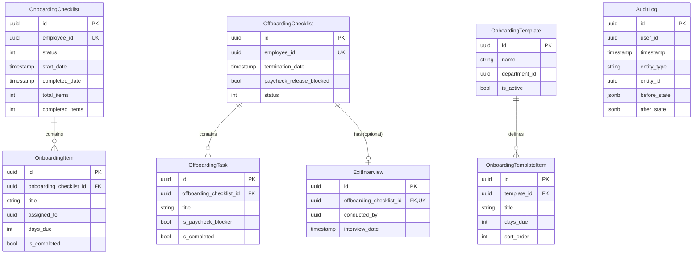

# Data Model: Lifecycle Service

**Feature**: Employee Lifecycle Management Service
**Branch**: `001-lifecycle-service`
**Generated**: 2025-12-28

## Overview

This document defines the complete data model for the Lifecycle Service, including entity schemas, relationships, validation rules, indexing strategy, and retention policies.

## Entity Schemas

### 1. OnboardingChecklist

**Purpose**: Tracks the complete onboarding workflow for a single employee.

**Table**: `onboarding_checklists`

| Column | Type | Constraints | Description |
|--------|------|-------------|-------------|
| id | UUID | PRIMARY KEY, DEFAULT gen_random_uuid() | Unique checklist identifier |
| employee_id | UUID | NOT NULL, UNIQUE | Reference to employee being onboarded |
| status | INTEGER | NOT NULL, DEFAULT 0 | OnboardingStatus enum (NotStarted=0, InProgress=1, Completed=2, Cancelled=3) |
| start_date | TIMESTAMP WITH TIME ZONE | NOT NULL | Employee's first day |
| completed_date | TIMESTAMP WITH TIME ZONE | NULL | When all items completed |
| total_items | INTEGER | NOT NULL, DEFAULT 0 | Count of all checklist items |
| completed_items | INTEGER | NOT NULL, DEFAULT 0 | Count of completed items |
| created_date | TIMESTAMP WITH TIME ZONE | NOT NULL, DEFAULT NOW() | Record creation timestamp |
| modified_date | TIMESTAMP WITH TIME ZONE | NULL | Last modification timestamp |

**Indexes**:
- PRIMARY KEY: `id`
- UNIQUE INDEX: `employee_id`
- INDEX: `(employee_id, status)` - For pending checklist queries
- INDEX: `status` - For filtering by status

**Validation Rules**:
- `employee_id` must not have an existing active checklist (status != Cancelled)
- `completed_items` must be <= `total_items`
- `completed_date` must be NULL unless `status` = Completed
- `completed_date` must be >= `start_date` if not NULL

**Cascade Rules**:
- DELETE: Cascade to OnboardingItem (ON DELETE CASCADE)

**Retention**: Indefinite (historical audit trail)

---

### 2. OnboardingItem

**Purpose**: Individual task within an onboarding checklist.

**Table**: `onboarding_items`

| Column | Type | Constraints | Description |
|--------|------|-------------|-------------|
| id | UUID | PRIMARY KEY, DEFAULT gen_random_uuid() | Unique item identifier |
| onboarding_checklist_id | UUID | NOT NULL, FOREIGN KEY → onboarding_checklists(id) ON DELETE CASCADE | Parent checklist |
| title | VARCHAR(200) | NOT NULL | Task title |
| description | TEXT | NULL | Detailed task description |
| category | INTEGER | NOT NULL | ItemCategory enum (Documentation=0, ITSetup=1, Training=2, Compliance=3, TeamIntroduction=4, Administrative=5) |
| assigned_to | UUID | NULL | Employee ID responsible for task |
| days_due | INTEGER | NOT NULL, DEFAULT 0 | Days from start_date for due date calculation |
| is_completed | BOOLEAN | NOT NULL, DEFAULT FALSE | Completion flag |
| completed_date | TIMESTAMP WITH TIME ZONE | NULL | When task was completed |
| completed_by | UUID | NULL | Employee ID who completed task |
| notes | TEXT | NULL | Additional notes or comments |
| sort_order | INTEGER | NOT NULL, DEFAULT 0 | Display order within checklist |
| created_date | TIMESTAMP WITH TIME ZONE | NOT NULL, DEFAULT NOW() | Record creation timestamp |

**Indexes**:
- PRIMARY KEY: `id`
- INDEX: `onboarding_checklist_id` - For checklist item queries
- INDEX: `assigned_to` - For user task queries
- INDEX: `(onboarding_checklist_id, is_completed)` - For incomplete task queries

**Validation Rules**:
- `title` must not be empty
- `days_due` must be >= 0
- `completed_date` must be NULL if `is_completed` = FALSE
- `completed_by` must NOT be NULL if `is_completed` = TRUE
- `completed_date` must be >= checklist.start_date + days_due if not NULL

**Business Logic**:
- Concurrent completion: First write wins (check `is_completed` flag in transaction)
- Reassignment: Can be changed by users with `lifecycle.manage` permission
- Due date: Calculated as checklist.start_date + days_due

---

### 3. OffboardingChecklist

**Purpose**: Tracks the complete offboarding workflow for a departing employee.

**Table**: `offboarding_checklists`

| Column | Type | Constraints | Description |
|--------|------|-------------|-------------|
| id | UUID | PRIMARY KEY, DEFAULT gen_random_uuid() | Unique checklist identifier |
| employee_id | UUID | NOT NULL, UNIQUE | Reference to employee being offboarded |
| termination_date | TIMESTAMP WITH TIME ZONE | NOT NULL | Employee's last day |
| termination_reason | TEXT | NOT NULL | Reason for departure |
| eligible_for_rehire | BOOLEAN | NOT NULL, DEFAULT TRUE | Rehire eligibility flag |
| status | INTEGER | NOT NULL, DEFAULT 0 | OffboardingStatus enum (NotStarted=0, InProgress=1, Completed=2, Cancelled=3) |
| paycheck_release_blocked | BOOLEAN | NOT NULL, DEFAULT TRUE | Whether final paycheck is blocked |
| completed_date | TIMESTAMP WITH TIME ZONE | NULL | When all tasks completed |
| created_date | TIMESTAMP WITH TIME ZONE | NOT NULL, DEFAULT NOW() | Record creation timestamp |
| modified_date | TIMESTAMP WITH TIME ZONE | NULL | Last modification timestamp |

**Indexes**:
- PRIMARY KEY: `id`
- UNIQUE INDEX: `employee_id`
- INDEX: `(employee_id, status)` - For pending checklist queries
- INDEX: `status` - For filtering by status
- INDEX: `paycheck_release_blocked` - For payroll queries

**Validation Rules**:
- `employee_id` must not have an existing active checklist (status != Cancelled)
- `termination_date` can be in the past (retroactive offboarding allowed)
- `completed_date` must be NULL unless `status` = Completed
- `paycheck_release_blocked` automatically updated based on IsPaycheckBlocker tasks

**Cascade Rules**:
- DELETE: Cascade to OffboardingTask and ExitInterview (ON DELETE CASCADE)

**Retention**: Indefinite (historical audit trail)

---

### 4. OffboardingTask

**Purpose**: Individual task within an offboarding checklist.

**Table**: `offboarding_tasks`

| Column | Type | Constraints | Description |
|--------|------|-------------|-------------|
| id | UUID | PRIMARY KEY, DEFAULT gen_random_uuid() | Unique task identifier |
| offboarding_checklist_id | UUID | NOT NULL, FOREIGN KEY → offboarding_checklists(id) ON DELETE CASCADE | Parent checklist |
| title | VARCHAR(200) | NOT NULL | Task title |
| description | TEXT | NULL | Detailed task description |
| category | INTEGER | NOT NULL | TaskCategory enum (Documentation=0, ITAccess=1, EquipmentReturn=2, KnowledgeTransfer=3, Financial=4, Administrative=5) |
| assigned_to | UUID | NULL | Employee ID responsible for task |
| is_paycheck_blocker | BOOLEAN | NOT NULL, DEFAULT FALSE | Whether task blocks paycheck release |
| is_completed | BOOLEAN | NOT NULL, DEFAULT FALSE | Completion flag |
| completed_date | TIMESTAMP WITH TIME ZONE | NULL | When task was completed |
| completed_by | UUID | NULL | Employee ID who completed task |
| notes | TEXT | NULL | Additional notes or comments |
| sort_order | INTEGER | NOT NULL, DEFAULT 0 | Display order within checklist |
| created_date | TIMESTAMP WITH TIME ZONE | NOT NULL, DEFAULT NOW() | Record creation timestamp |

**Indexes**:
- PRIMARY KEY: `id`
- INDEX: `offboarding_checklist_id` - For checklist task queries
- INDEX: `(offboarding_checklist_id, is_paycheck_blocker, is_completed)` - For paycheck blocking logic

**Validation Rules**:
- `title` must not be empty
- `completed_date` must be NULL if `is_completed` = FALSE
- `completed_by` must NOT be NULL if `is_completed` = TRUE

**Business Logic**:
- Concurrent completion: First write wins (check `is_completed` flag in transaction)
- Reassignment: Can be changed by users with `lifecycle.manage` permission
- Paycheck blocking: When last is_paycheck_blocker task completes, set checklist.paycheck_release_blocked = FALSE

---

### 5. ExitInterview

**Purpose**: Structured feedback collected during employee departure.

**Table**: `exit_interviews`

| Column | Type | Constraints | Description |
|--------|------|-------------|-------------|
| id | UUID | PRIMARY KEY, DEFAULT gen_random_uuid() | Unique interview identifier |
| offboarding_checklist_id | UUID | NOT NULL, UNIQUE, FOREIGN KEY → offboarding_checklists(id) | One-to-one with checklist |
| conducted_by | UUID | NOT NULL | Employee ID who conducted interview |
| interview_date | TIMESTAMP WITH TIME ZONE | NOT NULL | When interview occurred |
| reason_for_leaving | TEXT | NULL | Employee's stated reason |
| feedback_on_manager | TEXT | NULL | Manager feedback |
| feedback_on_team | TEXT | NULL | Team feedback |
| feedback_on_company | TEXT | NULL | Company feedback |
| improvement_suggestions | TEXT | NULL | Suggestions for improvement |
| would_recommend_company | BOOLEAN | NOT NULL, DEFAULT TRUE | Recommendation willingness |
| created_date | TIMESTAMP WITH TIME ZONE | NOT NULL, DEFAULT NOW() | Record creation timestamp |

**Indexes**:
- PRIMARY KEY: `id`
- UNIQUE INDEX: `offboarding_checklist_id`
- INDEX: `interview_date` - For reporting queries
- INDEX: `conducted_by` - For interviewer queries

**Validation Rules**:
- `interview_date` must be <= created_date
- `interview_date` must be >= checklist.termination_date - 90 days (interviews typically before last day)

**Access Control**:
- Read access: HR administrators (lifecycle.admin) + conducting interviewer (`conducted_by`)
- Write access: HR managers (lifecycle.manage)

**Retention**: 7 years from `created_date` (compliance requirement FR-013a)

**Privacy**: Contains sensitive feedback - restrict access per FR-013b

---

### 6. OnboardingTemplate

**Purpose**: Reusable blueprint for creating onboarding checklists.

**Table**: `onboarding_templates`

| Column | Type | Constraints | Description |
|--------|------|-------------|-------------|
| id | UUID | PRIMARY KEY, DEFAULT gen_random_uuid() | Unique template identifier |
| name | VARCHAR(100) | NOT NULL | Template display name |
| description | TEXT | NULL | Template description |
| department_id | UUID | NULL | Department this template is for (NULL = default) |
| is_active | BOOLEAN | NOT NULL, DEFAULT TRUE | Whether template can be used |
| created_date | TIMESTAMP WITH TIME ZONE | NOT NULL, DEFAULT NOW() | Record creation timestamp |
| modified_date | TIMESTAMP WITH TIME ZONE | NULL | Last modification timestamp |

**Indexes**:
- PRIMARY KEY: `id`
- INDEX: `department_id` - For template selection by department
- INDEX: `(department_id, is_active)` - For active template queries

**Validation Rules**:
- `name` must be unique per department_id (including NULL)
- At least one active default template (department_id = NULL) must exist

**Business Logic**:
- Template selection: Match department_id first, fallback to NULL
- Changes affect only NEW checklists (existing checklists remain unchanged)
- Deactivation: Set is_active = FALSE (preserve for existing checklists)

**Caching Strategy**:
- Redis cache key: `lifecycle:template:{department_id ?? Guid.Empty}`
- TTL: 1 hour
- Invalidation: On create/update/delete

---

### 7. OnboardingTemplateItem

**Purpose**: Defines standard tasks in an onboarding template.

**Table**: `onboarding_template_items`

| Column | Type | Constraints | Description |
|--------|------|-------------|-------------|
| id | UUID | PRIMARY KEY, DEFAULT gen_random_uuid() | Unique item identifier |
| template_id | UUID | NOT NULL, FOREIGN KEY → onboarding_templates(id) ON DELETE CASCADE | Parent template |
| title | VARCHAR(200) | NOT NULL | Task title |
| description | TEXT | NULL | Detailed task description |
| category | INTEGER | NOT NULL | ItemCategory enum |
| default_assignee_role | VARCHAR(50) | NULL | Role to assign (e.g., "IT", "HR", "Manager") |
| days_due | INTEGER | NOT NULL, DEFAULT 0 | Days from start_date for due date |
| sort_order | INTEGER | NOT NULL, DEFAULT 0 | Display order within template |

**Indexes**:
- PRIMARY KEY: `id`
- INDEX: `template_id` - For template item queries
- INDEX: `(template_id, sort_order)` - For ordered retrieval

**Validation Rules**:
- `title` must not be empty
- `days_due` must be >= 0
- `sort_order` should be unique within template (enforced in application)

**Business Logic**:
- When checklist created: Copy all items from template with calculated due dates
- `default_assignee_role` resolved to actual user ID during checklist creation (if available)

---

### 8. AuditLog

**Purpose**: Immutable audit trail for all state-changing operations.

**Table**: `audit_logs`

| Column | Type | Constraints | Description |
|--------|------|-------------|-------------|
| id | UUID | PRIMARY KEY, DEFAULT gen_random_uuid() | Unique log entry identifier |
| user_id | UUID | NOT NULL | User who performed action |
| timestamp | TIMESTAMP WITH TIME ZONE | NOT NULL, DEFAULT NOW() | When action occurred |
| entity_type | VARCHAR(100) | NOT NULL | Entity class name (e.g., "OnboardingChecklist") |
| entity_id | UUID | NOT NULL | ID of affected entity |
| action | VARCHAR(50) | NOT NULL | Action performed (Created, Updated, Deleted, Completed, Reassigned) |
| before_state | JSONB | NULL | JSON snapshot before change |
| after_state | JSONB | NULL | JSON snapshot after change |

**Indexes**:
- PRIMARY KEY: `id`
- INDEX: `(entity_type, entity_id)` - For entity history queries
- INDEX: `user_id` - For user activity queries
- INDEX: `timestamp` - For chronological queries
- INDEX: `(entity_type, entity_id, timestamp DESC)` - For recent entity changes

**Validation Rules**:
- `timestamp` must be <= NOW()
- `before_state` must be NULL for action = "Created"
- `after_state` must be NULL for action = "Deleted"

**Retention**: 7 years from `timestamp` (compliance requirement FR-025c)

**Access Control**: Read-only for audit administrators, write-only for system

**Immutability**: No UPDATE or DELETE allowed (INSERT-only)

---

## Entity Relationships



## Enumerations

### OnboardingStatus

```csharp
public enum OnboardingStatus
{
    NotStarted = 0,  // Checklist created but employee hasn't started
    InProgress = 1,  // At least one item completed, not all complete
    Completed = 2,   // All items completed
    Cancelled = 3    // Onboarding aborted (employee didn't join)
}
```

### OffboardingStatus

```csharp
public enum OffboardingStatus
{
    NotStarted = 0,  // Checklist created but not yet in progress
    InProgress = 1,  // At least one task completed, not all complete
    Completed = 2,   // All tasks completed
    Cancelled = 3    // Offboarding aborted (employee stayed)
}
```

### ItemCategory

```csharp
public enum ItemCategory
{
    Documentation = 0,      // Paperwork, forms, agreements
    ITSetup = 1,           // Equipment, accounts, access
    Training = 2,          // Orientation, skill training
    Compliance = 3,        // Legal, regulatory requirements
    TeamIntroduction = 4,  // Meet & greets, team onboarding
    Administrative = 5     // General admin tasks
}
```

### TaskCategory

```csharp
public enum TaskCategory
{
    Documentation = 0,      // Exit paperwork
    ITAccess = 1,          // Revoke accounts, credentials
    EquipmentReturn = 2,   // Return laptop, badge, etc.
    KnowledgeTransfer = 3, // Handoff responsibilities
    Financial = 4,         // Final pay, benefits
    Administrative = 5     // General admin tasks
}
```

## State Transitions

### OnboardingChecklist State Machine

```
NotStarted → InProgress: First item completed
InProgress → Completed: All items completed
InProgress → Cancelled: Manual cancellation
NotStarted → Cancelled: Manual cancellation
Cancelled → [terminal state, no transitions]
Completed → [terminal state, no transitions]
```

### OffboardingChecklist State Machine

```
NotStarted → InProgress: First task completed
InProgress → Completed: All tasks completed AND paycheck_release_blocked = FALSE
InProgress → Cancelled: Manual cancellation
NotStarted → Cancelled: Manual cancellation
Cancelled → [terminal state, no transitions]
Completed → [terminal state, no transitions]
```

## Data Integrity Rules

### Cross-Entity Constraints

1. **Onboarding uniqueness**: One active (status != Cancelled) OnboardingChecklist per employee_id
2. **Offboarding uniqueness**: One active (status != Cancelled) OffboardingChecklist per employee_id
3. **Exit interview uniqueness**: At most one ExitInterview per OffboardingChecklist
4. **Template item ordering**: OnboardingTemplateItem.sort_order should be unique within template_id
5. **Paycheck blocking logic**: OffboardingChecklist.paycheck_release_blocked = TRUE if any OffboardingTask has (is_paycheck_blocker = TRUE AND is_completed = FALSE)

### Calculated Fields

1. **OnboardingChecklist.total_items**: COUNT(OnboardingItem WHERE onboarding_checklist_id = id)
2. **OnboardingChecklist.completed_items**: COUNT(OnboardingItem WHERE onboarding_checklist_id = id AND is_completed = TRUE)
3. **OnboardingItem due date**: OnboardingChecklist.start_date + OnboardingItem.days_due
4. **OffboardingChecklist.paycheck_release_blocked**: EXISTS(OffboardingTask WHERE offboarding_checklist_id = id AND is_paycheck_blocker = TRUE AND is_completed = FALSE)

## Performance Optimizations

### Indexing Strategy

**High-Traffic Queries**:
1. Get pending onboardings: `WHERE status = 1 ORDER BY start_date`
   - Index: `(status, start_date)`
2. Get employee's checklist: `WHERE employee_id = ? AND status != 3`
   - Index: `(employee_id, status)`
3. Get incomplete tasks: `WHERE onboarding_checklist_id = ? AND is_completed = FALSE`
   - Index: `(onboarding_checklist_id, is_completed)`
4. Get overdue items: `WHERE start_date + days_due < NOW() AND is_completed = FALSE`
   - Index: `(is_completed, start_date, days_due)` (partial index)

**Cache Strategy**:
- Templates: Redis cache with 1-hour TTL
- Active checklists: Consider caching frequently accessed checklists (employee_id as key)

### Query Patterns

**Avoid**:
- SELECT * (use specific columns)
- N+1 queries (use Include() for related entities)
- Unbounded result sets (use pagination)

**Prefer**:
- AsNoTracking() for read-only queries
- Compiled queries for hot paths
- Batch operations for bulk inserts

## Data Retention & Archival

| Entity | Retention Period | Archival Strategy |
|--------|------------------|-------------------|
| OnboardingChecklist | Indefinite | None (historical record) |
| OnboardingItem | Indefinite | None (historical record) |
| OffboardingChecklist | Indefinite | None (historical record) |
| OffboardingTask | Indefinite | None (historical record) |
| ExitInterview | 7 years | Archive to cold storage after 7 years, purge after archive |
| OnboardingTemplate | Indefinite | Soft delete (is_active = FALSE) |
| OnboardingTemplateItem | Indefinite | Cascade delete with template |
| AuditLog | 7 years | Archive to cold storage after 7 years, purge after archive |

**Archive Process** (for ExitInterview and AuditLog):
1. Export to GCS cold storage bucket in Parquet format
2. Encrypt with customer-managed key
3. Verify successful export
4. DELETE FROM table WHERE created_date < (NOW() - INTERVAL '7 years')
5. Log archival operation in compliance audit log

## Migration Strategy

**Initial Schema Creation**:
1. Create all tables in dependency order (templates → checklists → items/tasks → exit interviews → audit logs)
2. Create all indexes
3. Seed default onboarding template (if required)

**Schema Changes**:
- Use EF Core migrations for all schema changes
- Backward-compatible migrations mandatory (add columns with NULL or DEFAULT)
- Data migrations separate from schema migrations

**Rollback Strategy**:
- Each migration must have a corresponding Down() method
- Test rollback in staging before production deployment
