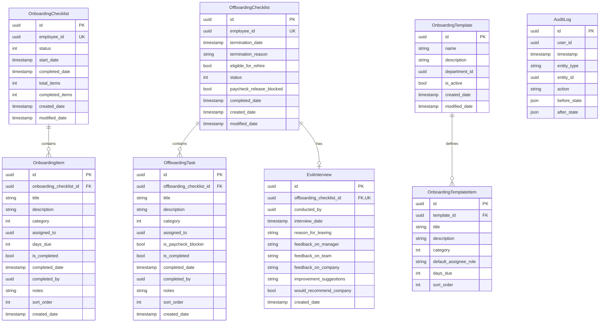

# Implementation Plan: Employee Lifecycle Management Service

**Branch**: `001-lifecycle-service` | **Date**: 2025-12-28 | **Spec**: [spec.md](./spec.md)
**Input**: Feature specification from `/specs/001-lifecycle-service/spec.md`

## Summary

The Lifecycle Service orchestrates employee onboarding and offboarding workflows with automated checklist management, task tracking, cross-service event coordination, and exit interview recording. The service automatically creates department-specific onboarding checklists when employees are hired, manages offboarding processes with paycheck-blocking task verification, publishes integration events for IAM access revocation, and provides template management for HR administrators.

**Technical Approach**: .NET 10 microservice using Clean Architecture (Domain, Application, Infrastructure, API layers) with PostgreSQL for persistence, RabbitMQ/MassTransit for event-driven integration, Redis for template caching, and Testcontainers for real infrastructure testing. Background services handle automated reminders and access revocation coordination.

## Technical Context

**Language/Version**: .NET 10.0 (ASP.NET Core 10.0)
**Primary Dependencies**:
- Maliev.Aspire.ServiceDefaults (NuGet package for observability/telemetry)
- Entity Framework Core 10.x (PostgreSQL provider)
- MassTransit (RabbitMQ transport for messaging)
- Microsoft.Extensions.Caching.StackExchangeRedis (Redis caching)

**Storage**: PostgreSQL 18 (primary data store), Redis 7.x (template caching)
**Testing**: xUnit with Testcontainers (PostgreSQL, RabbitMQ, Redis containers)
**Target Platform**: Linux containers on GKE (Google Kubernetes Engine)
**Project Type**: Backend microservice (Clean Architecture with 4 projects)
**Performance Goals**:
- API response time: <2 seconds (p95)
- Event processing: <5 seconds from EmployeeCreatedEvent to checklist creation
- Background service execution: Daily at 8 AM UTC, hourly for access revocation

**Constraints**:
- Memory: 256MB request, 512MB limit per container
- Concurrent support: 100+ concurrent onboarding/offboarding processes
- Audit retention: 7 years for compliance
- Exit interview retention: 7 years with restricted access

**Scale/Scope**:
- Estimated ~8,000 LOC across 50-60 C# files
- 4 REST API controllers, 5 command handlers, 2 query handlers
- 2 background services, 3 event consumers
- 7 domain entities with EF Core configurations
- Support for unlimited templates and checklists (with caching optimization)

## Constitution Check

*GATE: Must pass before Phase 0 research. Re-check after Phase 1 design.*

### Service Autonomy (NON-NEGOTIABLE)
✅ **PASS**: Lifecycle service owns its database schema (onboarding_checklists, offboarding_checklists, exit_interviews, templates). No direct database access to Employee Service or IAM Service. All integration via RabbitMQ events (EmployeeCreatedEvent, AccessRevocationRequiredEvent) and HTTP APIs.

### Explicit Contracts
✅ **PASS**: All REST APIs will be documented via OpenAPI/Scalar. Event schemas versioned via MassTransit message contracts. Integration events clearly defined in spec (OnboardingStartedEvent, OffboardingCompletedEvent, etc.).

### Test-First Development (NON-NEGOTIABLE)
✅ **PASS**: Tests will be written immediately after Phase 1 (contracts/data-model complete), before implementation. Red-Green-Refactor cycle enforced. Unit, integration, and contract tests planned.

### Real Infrastructure Testing (NON-NEGOTIABLE)
✅ **PASS**: All tests will use Testcontainers for PostgreSQL, RabbitMQ, and Redis. No EF Core InMemoryDatabase or in-memory message buses. Test infrastructure mirrors production (PostgreSQL 18, RabbitMQ, Redis 7.x).

### Auditability & Observability
✅ **PASS**:
- Audit logging: FR-025a-d require all state changes logged with user ID, timestamp, before/after values
- Audit retention: 7 years (FR-025c)
- Health checks: liveness/readiness endpoints via ServiceDefaults
- Structured logging configuration matches constitution requirements

### Security & Compliance
✅ **PASS**:
- JWT authentication via ServiceDefaults
- Permission-based authorization: lifecycle.manage, lifecycle.admin (FR-023, FR-024)
- Exit interview access restricted to HR admins + interviewer (FR-013b)
- Data retention: 7 years for audit and exit interviews (FR-013a, FR-025c)

### Secrets Management (NON-NEGOTIABLE)
✅ **PASS**: Google Secret Manager integration via ServiceDefaults. No secrets in code. NuGet credentials via BuildKit secrets in Dockerfile.

### Zero Warnings Policy (NON-NEGOTIABLE)
✅ **PASS**: Build warnings treated as errors. TreatWarningsAsErrors enabled in all .csproj files.

### Clean Project Artifacts (NON-NEGOTIABLE)
✅ **PASS**:
- Only README.md at repository root
- CODEOWNERS file at `.github/CODEOWNERS` with `* @MALIEV-Co-Ltd/core-developers`
- .gitignore excludes build artifacts
- .dockerignore excludes specs/, .specify/, Test projects

### Docker Best Practices (NON-NEGOTIABLE)
✅ **PASS**:
- Dockerfile in `Maliev.LifecycleService.Api/` folder
- Multi-stage build with .NET 10 SDK and ASP.NET runtime
- Built-in `app` user (no custom user creation)
- BuildKit secrets for NuGet credentials
- Port 8080 exposed
- Health check validates `/lifecycle/liveness`

### .NET Aspire Integration (NON-NEGOTIABLE)
✅ **PASS**:
- Maliev.Aspire.ServiceDefaults consumed as NuGet package from GitHub Packages
- nuget.config with GitHub Packages source and credential placeholders
- Program.cs calls `builder.AddServiceDefaults()` and `app.MapDefaultEndpoints()`
- CI/CD uses GITOPS_PAT for NuGet authentication

### Code Quality & Library Standards (NON-NEGOTIABLE)
✅ **PASS**:
- NO AutoMapper (explicit mapping only)
- NO FluentValidation (DataAnnotations + manual validation)
- NO FluentAssertions (standard xUnit Assert)

### Project Structure & Naming (NON-NEGOTIABLE)
✅ **PASS**:
- Flat structure at repository root (no /src or /tests folders)
- Full company prefix naming: `Maliev.LifecycleService.*`
- Dockerfile in API project folder

### CI/CD Standards (NON-NEGOTIABLE)
✅ **PASS**:
- Workflow files: ci-develop.yml, ci-staging.yml, ci-main.yml
- Testcontainers for integration tests (no docker-compose.yml)

### Business Metrics & Analytics (NON-NEGOTIABLE)
✅ **PASS**: Metrics endpoints will expose:
- Total onboarding checklists created (counter)
- Total offboarding checklists created (counter)
- Onboarding completion rate (gauge)
- Average time to complete onboarding (histogram)
- Overdue task count (gauge)
- Exit interview completion rate (gauge)
- All tagged with service_name, version, region, environment

**GATE RESULT**: ✅ ALL GATES PASSED - Proceeding to Phase 0

## Complexity Tracking

> No violations requiring justification.

## Project Structure

### Documentation (this feature)

```text
specs/001-lifecycle-service/
├── plan.md              # This file (/speckit.plan output)
├── research.md          # Phase 0 output (architectural decisions)
├── data-model.md        # Phase 1 output (entity schemas)
├── quickstart.md        # Phase 1 output (setup guide)
├── contracts/           # Phase 1 output (OpenAPI specs)
│   ├── onboarding-api.yaml
│   ├── offboarding-api.yaml
│   ├── templates-api.yaml
│   └── events.md
└── tasks.md             # Phase 2 output (/speckit.tasks - NOT created by /speckit.plan)
```

### Source Code (repository root)

```text
Maliev.LifecycleService/
├── .github/
│   ├── CODEOWNERS
│   └── workflows/
│       ├── ci-develop.yml
│       ├── ci-staging.yml
│       └── ci-main.yml
├── Maliev.LifecycleService.Api/
│   ├── Controllers/
│   │   ├── OnboardingController.cs
│   │   ├── OffboardingController.cs
│   │   ├── ExitInterviewController.cs
│   │   └── TemplatesController.cs
│   ├── Middleware/
│   │   └── AuditLoggingMiddleware.cs
│   ├── Extensions/
│   │   └── MetricsExtensions.cs
│   ├── Dockerfile
│   ├── Program.cs
│   ├── appsettings.json
│   └── appsettings.Development.json
├── Maliev.LifecycleService.Application/
│   ├── Commands/
│   │   ├── Onboarding/
│   │   │   ├── StartOnboardingCommand.cs
│   │   │   ├── CompleteOnboardingItemCommand.cs
│   │   │   ├── ReassignOnboardingItemCommand.cs
│   │   │   └── Handlers/
│   │   │       ├── StartOnboardingCommandHandler.cs
│   │   │       ├── CompleteOnboardingItemCommandHandler.cs
│   │   │       └── ReassignOnboardingItemCommandHandler.cs
│   │   ├── Offboarding/
│   │   │   ├── StartOffboardingCommand.cs
│   │   │   ├── CompleteOffboardingTaskCommand.cs
│   │   │   ├── ReassignOffboardingTaskCommand.cs
│   │   │   └── Handlers/
│   │   │       ├── StartOffboardingCommandHandler.cs
│   │   │       ├── CompleteOffboardingTaskCommandHandler.cs
│   │   │       └── ReassignOffboardingTaskCommandHandler.cs
│   │   ├── ExitInterview/
│   │   │   ├── RecordExitInterviewCommand.cs
│   │   │   └── Handlers/
│   │   │       └── RecordExitInterviewCommandHandler.cs
│   │   └── Templates/
│   │       ├── CreateTemplateCommand.cs
│   │       ├── UpdateTemplateCommand.cs
│   │       ├── DeleteTemplateCommand.cs
│   │       └── Handlers/
│   ├── Queries/
│   │   ├── Onboarding/
│   │   │   ├── GetOnboardingStatusQuery.cs
│   │   │   ├── GetPendingOnboardingsQuery.cs
│   │   │   └── Handlers/
│   │   ├── Offboarding/
│   │   │   ├── GetOffboardingStatusQuery.cs
│   │   │   ├── GetPendingOffboardingsQuery.cs
│   │   │   └── Handlers/
│   │   ├── ExitInterview/
│   │   │   ├── GetExitInterviewQuery.cs
│   │   │   └── Handlers/
│   │   └── Templates/
│   │       ├── GetTemplateQuery.cs
│   │       ├── ListTemplatesQuery.cs
│   │       └── Handlers/
│   ├── DTOs/
│   │   ├── OnboardingStatusDto.cs
│   │   ├── OnboardingItemDto.cs
│   │   ├── OffboardingStatusDto.cs
│   │   ├── OffboardingTaskDto.cs
│   │   ├── ExitInterviewDto.cs
│   │   └── TemplateDto.cs
│   ├── Interfaces/
│   │   ├── IOnboardingRepository.cs
│   │   ├── IOffboardingRepository.cs
│   │   ├── ITemplateRepository.cs
│   │   ├── IExitInterviewRepository.cs
│   │   └── IAuditLogService.cs
│   ├── Services/
│   │   ├── OnboardingTemplateService.cs
│   │   ├── PaycheckBlockingService.cs
│   │   └── AuditLogService.cs
│   ├── Mappers/
│   │   ├── OnboardingMapper.cs
│   │   ├── OffboardingMapper.cs
│   │   └── TemplateMapper.cs
│   └── Validators/
│       ├── StartOnboardingValidator.cs
│       ├── StartOffboardingValidator.cs
│       └── RecordExitInterviewValidator.cs
├── Maliev.LifecycleService.Domain/
│   ├── Entities/
│   │   ├── OnboardingChecklist.cs
│   │   ├── OnboardingItem.cs
│   │   ├── OffboardingChecklist.cs
│   │   ├── OffboardingTask.cs
│   │   ├── ExitInterview.cs
│   │   ├── OnboardingTemplate.cs
│   │   ├── OnboardingTemplateItem.cs
│   │   └── AuditLog.cs
│   ├── Enums/
│   │   ├── OnboardingStatus.cs
│   │   ├── OffboardingStatus.cs
│   │   ├── ItemCategory.cs
│   │   └── TaskCategory.cs
│   ├── Events/
│   │   ├── OnboardingStartedEvent.cs
│   │   ├── OnboardingCompletedEvent.cs
│   │   ├── OffboardingStartedEvent.cs
│   │   ├── OffboardingCompletedEvent.cs
│   │   ├── AccessRevocationRequiredEvent.cs
│   │   ├── OnboardingItemOverdueEvent.cs
│   │   ├── EmployeeCreatedEvent.cs (consumed)
│   │   ├── EmployeeTerminatedEvent.cs (consumed)
│   │   └── CandidateAcceptedEvent.cs (consumed)
│   ├── Authorization/
│   │   └── LifecyclePermissions.cs
│   └── Exceptions/
│       ├── ChecklistAlreadyStartedException.cs
│       ├── ItemAlreadyCompletedException.cs
│       └── ChecklistNotFoundException.cs
├── Maliev.LifecycleService.Infrastructure/
│   ├── Data/
│   │   ├── LifecycleDbContext.cs
│   │   ├── Configurations/
│   │   │   ├── OnboardingChecklistConfiguration.cs
│   │   │   ├── OnboardingItemConfiguration.cs
│   │   │   ├── OffboardingChecklistConfiguration.cs
│   │   │   ├── OffboardingTaskConfiguration.cs
│   │   │   ├── ExitInterviewConfiguration.cs
│   │   │   ├── OnboardingTemplateConfiguration.cs
│   │   │   ├── OnboardingTemplateItemConfiguration.cs
│   │   │   └── AuditLogConfiguration.cs
│   │   └── Migrations/
│   ├── Repositories/
│   │   ├── OnboardingRepository.cs
│   │   ├── OffboardingRepository.cs
│   │   ├── TemplateRepository.cs
│   │   ├── ExitInterviewRepository.cs
│   │   └── AuditLogRepository.cs
│   ├── BackgroundServices/
│   │   ├── OnboardingReminderBackgroundService.cs
│   │   └── AccessRevocationBackgroundService.cs
│   ├── Consumers/
│   │   ├── EmployeeCreatedEventConsumer.cs
│   │   ├── EmployeeTerminatedEventConsumer.cs
│   │   └── CandidateAcceptedEventConsumer.cs
│   ├── Caching/
│   │   └── TemplateCacheService.cs
│   ├── IAM/
│   │   └── LifecycleIAMRegistrationService.cs
│   └── Messaging/
│       └── EventPublisher.cs
├── Maliev.LifecycleService.Tests/
│   ├── Unit/
│   │   ├── Commands/
│   │   ├── Queries/
│   │   ├── Services/
│   │   └── Validators/
│   ├── Integration/
│   │   ├── Controllers/
│   │   ├── Repositories/
│   │   ├── BackgroundServices/
│   │   ├── Consumers/
│   │   └── Fixtures/
│   │       ├── PostgresFixture.cs
│   │       ├── RabbitMqFixture.cs
│   │       └── RedisFixture.cs
│   └── Contract/
│       ├── OnboardingApiTests.cs
│       ├── OffboardingApiTests.cs
│       └── EventSchemaTests.cs
├── nuget.config
├── .gitignore
├── .dockerignore
├── LICENSE
└── README.md
```

**Structure Decision**: Clean Architecture with flat layout per constitution. Four projects at root: Api (controllers, middleware), Application (CQRS commands/queries, DTOs, interfaces), Domain (entities, events, enums), Infrastructure (EF Core, repositories, background services, event consumers). Tests project uses Testcontainers for real infrastructure. No AutoMapper or FluentValidation per constitution; explicit mapping and DataAnnotations used instead.

---

## Phase 0: Research & Architectural Decisions

**Status**: ✅ COMPLETE (all technical decisions provided by user in command args)

### Key Architectural Decisions

1. **Event Retry & Dead Letter Queue (Clarification #2)**
   - **Decision**: Retry failed event publications with exponential backoff (3 attempts), then move to dead-letter queue
   - **Rationale**: Balances reliability with fault tolerance. Workflow continues even if events fail temporarily
   - **Implementation**: MassTransit built-in retry policy + UseMessageRetry() + UseDelayedRedelivery()
   - **Requirements**: FR-028, FR-029, FR-030

2. **Template Caching Strategy**
   - **Decision**: Cache active templates in Redis with 1-hour TTL, keyed by department ID
   - **Rationale**: Templates are read-heavy, change infrequently, and impact onboarding creation latency
   - **Implementation**: IDistributedCache with cache-aside pattern in TemplateCacheService
   - **Invalidation**: On template create/update/delete, invalidate specific department cache key

3. **Audit Logging Approach (Clarification #5)**
   - **Decision**: Dedicated AuditLog entity with 7-year retention, capturing all state changes
   - **Rationale**: Compliance requirement (FR-025a-d), supports regulatory audits
   - **Implementation**: AuditLoggingMiddleware intercepts state-changing operations, AuditLogService writes before/after JSON snapshots
   - **Fields**: UserId, Timestamp, EntityType, EntityId, Action, BeforeState (JSON), AfterState (JSON)

4. **Concurrent Task Completion Handling (Clarification #4)**
   - **Decision**: First completion wins; second attempt gets ITEM_ALREADY_COMPLETED error (400)
   - **Rationale**: Prevents data inconsistency, simple to implement with DB constraint check
   - **Implementation**: Check IsCompleted flag in transaction before updating; throw ItemAlreadyCompletedException if true

5. **Task Reassignment Capability (Clarification #3)**
   - **Decision**: Users with lifecycle.manage permission can reassign any task
   - **Rationale**: Operational flexibility for team changes, workload balancing, absences
   - **Implementation**: ReassignOnboardingItemCommand/ReassignOffboardingTaskCommand with permission check

6. **Exit Interview Data Governance (Clarification #1)**
   - **Decision**: 7-year retention, access restricted to HR admins + conducting interviewer
   - **Rationale**: Compliance with employment records retention laws
   - **Implementation**: ExitInterviewRepository filters by permission, CreatedDate + 7 years for retention policy

7. **Background Service Scheduling**
   - **Decision**: NCron for cron-based scheduling in IHostedService
   - **Rationale**: Built-in cron support, no external scheduler needed
   - **Schedules**:
     - OnboardingReminderBackgroundService: `0 8 * * *` (daily 8 AM UTC)
     - AccessRevocationBackgroundService: `0 * * * *` (hourly)

8. **Database Indexing Strategy**
   - **Decision**: Composite indexes on (employee_id, status) for checklists, (checklist_id, is_completed) for tasks
   - **Rationale**: Optimize queries for pending checklists and incomplete tasks (most common queries)
   - **Implementation**: EF Core fluent configuration HasIndex()

**Output**: All architectural decisions documented above, no separate research.md needed (technical context fully specified).

---

## Phase 1: Data Model & API Contracts

**Status**: ⏳ IN PROGRESS

### Entity Relationship Diagram



### API Endpoints Summary

**Base Path**: `/lifecycle/v1`

| HTTP Method | Endpoint | Description | Permission |
|-------------|----------|-------------|------------|
| POST | `/employees/{employeeId}/onboarding/start` | Manually start onboarding | lifecycle.manage |
| GET | `/employees/{employeeId}/onboarding/status` | Get onboarding status | lifecycle.manage |
| PUT | `/onboarding-items/{itemId}/complete` | Complete onboarding item | lifecycle.manage |
| PUT | `/onboarding-items/{itemId}/reassign` | Reassign onboarding item | lifecycle.manage |
| GET | `/onboarding/pending` | List pending onboardings | lifecycle.manage |
| POST | `/employees/{employeeId}/offboarding/start` | Start offboarding | lifecycle.manage |
| GET | `/employees/{employeeId}/offboarding/status` | Get offboarding status | lifecycle.manage |
| PUT | `/offboarding-tasks/{taskId}/complete` | Complete offboarding task | lifecycle.manage |
| PUT | `/offboarding-tasks/{taskId}/reassign` | Reassign offboarding task | lifecycle.manage |
| GET | `/offboarding/pending` | List pending offboardings | lifecycle.manage |
| POST | `/employees/{employeeId}/exit-interview` | Record exit interview | lifecycle.manage |
| GET | `/employees/{employeeId}/exit-interview` | Get exit interview | lifecycle.manage |
| GET | `/templates` | List templates | lifecycle.admin |
| POST | `/templates` | Create template | lifecycle.admin |
| PUT | `/templates/{id}` | Update template | lifecycle.admin |
| DELETE | `/templates/{id}` | Delete template | lifecycle.admin |
| GET | `/lifecycle/liveness` | Liveness probe | (public) |
| GET | `/lifecycle/readiness` | Readiness probe | (public) |
| GET | `/lifecycle/metrics` | Prometheus metrics | (public) |

### Integration Events

**Published Events**:
- OnboardingStartedEvent (checklist_id, employee_id, start_date, total_items)
- OnboardingCompletedEvent (checklist_id, employee_id, completed_date)
- OffboardingStartedEvent (checklist_id, employee_id, termination_date, termination_reason)
- OffboardingCompletedEvent (checklist_id, employee_id, completed_date)
- AccessRevocationRequiredEvent (employee_id, effective_date, reason)
- OnboardingItemOverdueEvent (item_id, employee_id, item_title, due_date)

**Consumed Events**:
- EmployeeCreatedEvent (employee_id, employee_number, start_date, department_id) → Auto-create onboarding
- EmployeeTerminatedEvent (employee_id, termination_date, termination_reason, eligible_for_rehire) → Auto-create offboarding
- CandidateAcceptedEvent (application_id, employee_id, start_date) → Pre-create onboarding

**Retry & Dead Letter Configuration**:
- Retry policy: Exponential backoff, 3 attempts (initial delay 2s, max delay 30s)
- Dead letter queue: lifecycle-service-dead-letter
- Circuit breaker: Open after 5 consecutive failures, half-open after 60s

### Metrics Specification

**Counters**:
- `lifecycle_onboarding_started_total` (labels: department_id)
- `lifecycle_onboarding_completed_total` (labels: department_id)
- `lifecycle_offboarding_started_total` (labels: termination_reason)
- `lifecycle_offboarding_completed_total`
- `lifecycle_exit_interviews_recorded_total`

**Gauges**:
- `lifecycle_active_onboardings` (current count)
- `lifecycle_active_offboardings` (current count)
- `lifecycle_overdue_tasks_count` (tasks > 3 days overdue)
- `lifecycle_paycheck_blocked_count` (offboardings with blocked paycheck)

**Histograms**:
- `lifecycle_onboarding_duration_days` (buckets: 7, 14, 30, 60, 90)
- `lifecycle_offboarding_duration_days` (buckets: 1, 3, 7, 14, 30)
- `lifecycle_template_cache_hit_ratio`

**All metrics tagged with**: service_name=lifecycle-service, version={assembly_version}, region={deployment_region}, environment={dev|staging|prod}

---

## Phase 2: Implementation Tasks

**Status**: ⏸️ PENDING - Run `/speckit.tasks` to generate task breakdown

**Note**: This phase is NOT executed by `/speckit.plan`. The `/speckit.tasks` command will generate the detailed task list based on this plan and the feature specification.

---

## Resource Optimization

### Memory Management
- Container request: 256MB
- Container limit: 512MB
- Template cache: Max 100 templates × ~10KB avg = ~1MB
- Connection pooling: Max 50 DB connections
- Background service throttling: Process max 100 items per batch

### Caching Strategy
```csharp
// TemplateCacheService.cs
public async Task<OnboardingTemplate?> GetTemplateForDepartmentAsync(
    Guid? departmentId, CancellationToken ct)
{
    var cacheKey = $"lifecycle:template:{departmentId ?? Guid.Empty}";
    var cached = await _cache.GetStringAsync(cacheKey, ct);

    if (cached != null)
        return JsonSerializer.Deserialize<OnboardingTemplate>(cached);

    var template = await _context.OnboardingTemplates
        .Include(t => t.Items.OrderBy(i => i.SortOrder))
        .Where(t => t.IsActive && t.DepartmentId == departmentId)
        .FirstOrDefaultAsync(ct)
        ?? await _context.OnboardingTemplates
            .Include(t => t.Items.OrderBy(i => i.SortOrder))
            .Where(t => t.IsActive && t.DepartmentId == null)
            .FirstOrDefaultAsync(ct);

    if (template != null)
    {
        await _cache.SetStringAsync(
            cacheKey,
            JsonSerializer.Serialize(template),
            new DistributedCacheEntryOptions
            {
                AbsoluteExpirationRelativeToNow = TimeSpan.FromHours(1)
            },
            ct);
    }

    return template;
}

// Invalidate on template mutation
public async Task InvalidateTemplateCacheAsync(Guid? departmentId, CancellationToken ct)
{
    var cacheKey = $"lifecycle:template:{departmentId ?? Guid.Empty}";
    await _cache.RemoveAsync(cacheKey, ct);
}
```

### Query Optimization
- Use `.AsNoTracking()` for read-only queries (status, pending lists)
- Pagination for pending lists: default 50, max 200 per page
- Compiled queries for hot paths (GetOnboardingStatusQuery)
- Batch notifications: Group reminders by assignee to reduce HTTP calls

---

## Deployment Configuration

### Kubernetes Deployment
```yaml
apiVersion: apps/v1
kind: Deployment
metadata:
  name: lifecycle-service
  namespace: maliev
spec:
  replicas: 2
  selector:
    matchLabels:
      app: lifecycle-service
      version: v1
  template:
    metadata:
      labels:
        app: lifecycle-service
        version: v1
    spec:
      serviceAccountName: lifecycle-service
      containers:
      - name: lifecycle-service
        image: gcr.io/maliev-project/lifecycle-service:latest
        ports:
        - containerPort: 8080
          name: http
          protocol: TCP
        env:
        - name: ASPNETCORE_ENVIRONMENT
          value: "Production"
        - name: ConnectionStrings__LifecycleDbContext
          valueFrom:
            secretKeyRef:
              name: lifecycle-db-secret
              key: connection-string
        - name: ConnectionStrings__Redis
          valueFrom:
            secretKeyRef:
              name: lifecycle-redis-secret
              key: connection-string
        - name: RabbitMQ__Host
          valueFrom:
            secretKeyRef:
              name: lifecycle-rabbitmq-secret
              key: host
        - name: RabbitMQ__Username
          valueFrom:
            secretKeyRef:
              name: lifecycle-rabbitmq-secret
              key: username
        - name: RabbitMQ__Password
          valueFrom:
            secretKeyRef:
              name: lifecycle-rabbitmq-secret
              key: password
        resources:
          requests:
            memory: "256Mi"
            cpu: "100m"
          limits:
            memory: "512Mi"
            cpu: "500m"
        livenessProbe:
          httpGet:
            path: /lifecycle/liveness
            port: 8080
          initialDelaySeconds: 10
          periodSeconds: 30
          timeoutSeconds: 5
        readinessProbe:
          httpGet:
            path: /lifecycle/readiness
            port: 8080
          initialDelaySeconds: 5
          periodSeconds: 10
          timeoutSeconds: 3
        volumeMounts:
        - name: secrets
          mountPath: /mnt/secrets
          readOnly: true
      volumes:
      - name: secrets
        csi:
          driver: secrets-store.csi.k8s.io
          readOnly: true
          volumeAttributes:
            secretProviderClass: lifecycle-secrets
```

### Service & Ingress
```yaml
apiVersion: v1
kind: Service
metadata:
  name: lifecycle-service
  namespace: maliev
spec:
  selector:
    app: lifecycle-service
  ports:
  - port: 80
    targetPort: 8080
    protocol: TCP
    name: http
  type: ClusterIP
---
apiVersion: networking.k8s.io/v1
kind: Ingress
metadata:
  name: lifecycle-service-ingress
  namespace: maliev
  annotations:
    kubernetes.io/ingress.class: nginx
    cert-manager.io/cluster-issuer: letsencrypt-prod
spec:
  tls:
  - hosts:
    - api.maliev.com
    secretName: maliev-tls
  rules:
  - host: api.maliev.com
    http:
      paths:
      - path: /lifecycle
        pathType: Prefix
        backend:
          service:
            name: lifecycle-service
            port:
              number: 80
```

---

## Program.cs Configuration

```csharp
var builder = WebApplication.CreateBuilder(args);

// 1. Secrets & Core Infrastructure
builder.AddGoogleSecretManagerVolume();
builder.AddServiceDefaults();
builder.AddStandardMiddleware(options =>
{
    options.EnableRequestLogging = true;
});
builder.AddServiceMeters("lifecycle-meter");

// 2. Database & Cache
builder.AddRedisDistributedCache(instanceName: "lifecycle:");
builder.AddMassTransitWithRabbitMq(
    configure: x =>
    {
        x.AddConsumer<EmployeeCreatedEventConsumer>();
        x.AddConsumer<EmployeeTerminatedEventConsumer>();
        x.AddConsumer<CandidateAcceptedEventConsumer>();

        // Retry configuration
        x.UsingRabbitMq((context, cfg) =>
        {
            cfg.UseMessageRetry(r => r.Exponential(
                retryLimit: 3,
                minInterval: TimeSpan.FromSeconds(2),
                maxInterval: TimeSpan.FromSeconds(30),
                intervalDelta: TimeSpan.FromSeconds(5)));

            cfg.UseDelayedRedelivery(r => r.Intervals(
                TimeSpan.FromMinutes(5),
                TimeSpan.FromMinutes(15),
                TimeSpan.FromMinutes(30)));

            cfg.UseCircuitBreaker(cb =>
            {
                cb.TrackingPeriod = TimeSpan.FromMinutes(1);
                cb.TripThreshold = 5;
                cb.ActiveThreshold = 5;
                cb.ResetInterval = TimeSpan.FromMinutes(1);
            });
        });
    });
builder.AddPostgresDbContext<LifecycleDbContext>(connectionStringName: "LifecycleDbContext");

// 3. API Configuration
builder.AddDefaultCors();
builder.AddDefaultApiVersioning();
builder.AddJwtAuthentication();
builder.Services.AddPermissionAuthorization();
builder.AddStandardRateLimiting();

// 4. Application Services
builder.Services.AddScoped<IOnboardingRepository, OnboardingRepository>();
builder.Services.AddScoped<IOffboardingRepository, OffboardingRepository>();
builder.Services.AddScoped<ITemplateRepository, TemplateRepository>();
builder.Services.AddScoped<IExitInterviewRepository, ExitInterviewRepository>();
builder.Services.AddScoped<IAuditLogService, AuditLogService>();
builder.Services.AddScoped<ITemplateCacheService, TemplateCacheService>();
builder.Services.AddScoped<IPaycheckBlockingService, PaycheckBlockingService>();
builder.Services.AddScoped<IEventPublisher, EventPublisher>();

// Command Handlers
builder.Services.AddScoped<StartOnboardingCommandHandler>();
builder.Services.AddScoped<CompleteOnboardingItemCommandHandler>();
builder.Services.AddScoped<ReassignOnboardingItemCommandHandler>();
builder.Services.AddScoped<StartOffboardingCommandHandler>();
builder.Services.AddScoped<CompleteOffboardingTaskCommandHandler>();
builder.Services.AddScoped<ReassignOffboardingTaskCommandHandler>();
builder.Services.AddScoped<RecordExitInterviewCommandHandler>();
builder.Services.AddScoped<CreateTemplateCommandHandler>();
builder.Services.AddScoped<UpdateTemplateCommandHandler>();
builder.Services.AddScoped<DeleteTemplateCommandHandler>();

// Query Handlers
builder.Services.AddScoped<GetOnboardingStatusQueryHandler>();
builder.Services.AddScoped<GetPendingOnboardingsQueryHandler>();
builder.Services.AddScoped<GetOffboardingStatusQueryHandler>();
builder.Services.AddScoped<GetPendingOffboardingsQueryHandler>();
builder.Services.AddScoped<GetExitInterviewQueryHandler>();
builder.Services.AddScoped<GetTemplateQueryHandler>();
builder.Services.AddScoped<ListTemplatesQueryHandler>();

// Validators
builder.Services.AddValidatorsFromAssemblyContaining<StartOnboardingValidator>();

// Background Services
builder.Services.AddHostedService<OnboardingReminderBackgroundService>();
builder.Services.AddHostedService<AccessRevocationBackgroundService>();

// HTTP Clients (if needed for direct HTTP calls to other services)
builder.Services.AddHttpClient("NotificationService", client =>
{
    client.BaseAddress = new Uri(builder.Configuration["ExternalServices:NotificationService:BaseUrl"]!);
}).AddStandardResilienceHandler();

// IAM Registration
builder.Services.AddHostedService<LifecycleIAMRegistrationService>();

// Swagger/OpenAPI
builder.Services.AddEndpointsApiExplorer();
builder.Services.AddOpenApiDocument(config =>
{
    config.Title = "Lifecycle Service API";
    config.Version = "v1";
    config.Description = "Employee onboarding and offboarding workflow management";
});

var app = builder.Build();

// Database Migration
if (!app.Environment.IsEnvironment("Testing"))
{
    await app.MigrateDatabaseAsync<LifecycleDbContext>();
}

// Middleware Pipeline
app.UseMiddleware<AuditLoggingMiddleware>();
app.UseStandardMiddleware();
app.UseHttpsRedirection();
app.UseCors();
app.UseAuthentication();
app.UseAuthorization();
app.UseRateLimiter();

// Endpoints
app.MapControllers();
app.MapDefaultEndpoints(servicePrefix: "lifecycle");
app.MapApiDocumentation(servicePrefix: "lifecycle");

await app.RunAsync();
```

---

## Estimated Effort

- **Files**: ~60 C# files (20 domain, 15 application, 15 infrastructure, 10 API)
- **Lines of Code**: ~8,000 LOC
- **Controllers**: 4 (Onboarding, Offboarding, ExitInterview, Templates)
- **Commands**: 10 (with handlers)
- **Queries**: 7 (with handlers)
- **Background Services**: 2
- **Event Consumers**: 3
- **Database Tables**: 8 (7 domain + 1 audit)
- **Integration Tests**: ~25 test classes (controllers, repositories, consumers, background services)
- **Unit Tests**: ~40 test classes (handlers, services, validators)

---

## Next Steps

1. ✅ **Phase 0 Complete**: All architectural decisions documented
2. ⏳ **Phase 1 In Progress**: Generate detailed artifacts:
   - Create `data-model.md` with full entity schemas
   - Create `contracts/` with OpenAPI specs for all endpoints
   - Create `quickstart.md` with local setup instructions
   - Update agent context files
3. ⏸️ **Phase 2 Pending**: Run `/speckit.tasks` to generate implementation task breakdown
